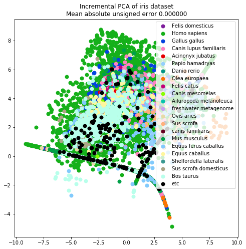

[문서] ML하려는 문서
=====================
오현석연구원의 요청으로 다시(?!) 시작해보았음.  
뭔가 ~~원래도 없었다만~~ 이쪽 분야에 ML을 끼얹고 싶긴 하나보다  
~~아니 사실 내가하던거 ㅊㅊ했더니 주객이 전도된 느낌이긴 함~~  
~~문체가 개판인건 느그직원이 하는거라 그려려니 하셈~~  
~~누가 꺼어어억 할지 궁금은 하네….ㅅㅂ~~  
****

# 1. 그래서 하려는 것 (개괄)
데이터 받는 부분은 bash와 node를 사용함  
데이터 연산하는 부분은 python을 사용함  
어짜피 json으로 주고받을꺼라 큰 상관은 없어보임...  
왜 numpy를 사용 하지 말아야할 라이브러리라 생각하는지 모르겠다. C++ stl도 참조하지 말라할 기세ㅋㅋㅋ  

각설하고 하려는 것은 다음과 같다.  
  
ML 하긴 할꺼다. 사실 svm같은거 쓰기는 함  
regression은 내가 모름ㅋㅋ  
RL은 state-action-reward 구조로 해당 문제를 설계를 할 수 없어서 안댐. 누가 알파고 알파고 같은 소리하면 그냥 죽빵 날려라...  
  

## 1.1. 데이터 수집
NCBI/MGRAST에서 얻은 public data를 받는 작업을 설명한다. node로 짰다. lambda / express 두가지 버전 있다.   
위 작업을 하다보니 모든 부분을 AWS에 옮길 수 있을 것 __같아보였다__.  
  
우선 프로젝트 accession(ex.PRJEB20022, mgp601, SRP0012321) 을 받으면 해당 프로젝트가 있는지, 없는지,   
있다면 몇번 project(1.5v)였는지 return으로 주는 건 구현했다.(gateway-lambda-dynamodb 부분)   
신규 프로젝트 추가는 매뉴얼하게 해야하는 부분이 있어서 아직 안함 (다운로드 받는건 해봄직한데...lambda로 shell 돌아가나?)    
링크는 다음과 같다  
 * https://usg5aff7h9.execute-api.ap-northeast-2.amazonaws.com/Prod/?query=your_query  
   
meta data는 뭐 일부는 위에 작업단에서 얻을 수는 있는데, 결국 사람손을 거치기는 해야함...(논문에 따로 meta를 넣는다던지)  

## 1.2. 데이터 처리 (pipeline)
### 1.2.0 AWS
사실 ECS로 구현하기 참 꼴릿한 항목이다. lambda에 때려넣기엔 구현체가 너무 크기도 하고, 오래걸리는 부분이 있음.(내가 짠게 아님)   
근데 문제는 Fargate-vpc 이용이 한국섭에서는 안된다는 얘기를 얼핏 들었던거 같기는 하다.  
내일 교육가보고 생각해봐야겠다. (Kubernetes로는 안되는건가?)  
사실 docker 문법 잘 모르겠음...완성되면 업데이트 할꺼임  

### 1.2.1. 전처리 (preprocessing)
primer(있다면) 제거한다. paired end면 merge한다.(아마 java로 짜여있을 것)   
region 정보는 어찌어찌 구할 수 있는데 primer 유무는...(사실 grep 써서 하면 될 듯 하긴 하다.)  
뭐 사람들이 public data 잘 올려주면 다행인데, 그냥 대충 넣는 인간들이 있으면 그거대로 골때리긴 하다.  
pipeline 버전이 올라가면서 해당 과정이 그냥 pipeline과정에 포함되어있을 수도....확인해봐야함  

### 1.2.2. 처리(pipeline)
사실 정확하게는 뭐 하는지는 모르겠다.(아마 java로 짜여있을 것)    
db에다가 sequence 때려보고 뭔지 assign하는 과정이랑 otu계산하는 과정이 주라는 것만 안다.  
assign하는건 그냥 db search니까 걍 내가 짜봄직한데, otu계산은 나도 잘 모른다.  
~~(일단은 이미 있는 코드 그대로 사용하기로 한다)~~  
이전 pipeline에 비해서 validation 기준이 많이 완화되었다. 하지만 이 validation기준은 윤박사의 주관적인 기준이므로,  
이런 error가 뜨면 그냥 chimera가 많던지, valid read가 적던지 같은 현상적인것만 알 수 있다. 실험팀 탓인지, 고객탓인지 알 수 없다.  
~~자체 QC가 안된다고 봐도 좋다~~ 그러니까 왜 그런 기준을 적용했나요라고 __나한테 묻지 마라.__  

### 1.2.3. 후처리
있나? 그냥 현재는 s3에 올리고 meta랑 연결짓는거 아닌가?
****

## 1.3. API-refactoring
### 1.3.1. 배경
현재 해당 작업이 올라가는 (구)Bioiplug는 원치 않는 자식같은 프로그램이라, 설계가 좀 개판이다.  
2018/6/18일 기준으로 meta를 넣을 수 있는 방법이 __없다.__  
대체 연구자가 쓰라고 만들었으면 programmable해야하지 않나? 라는 생각을 해보지만,  
이 분야 사람들 공짜로 졸업을 하려는 머머리들이 많아서그런지, 회사 안에서도 bioiplug쓰지 않는다.  
이게 문제인게, 내가 뭘 하려고 해도, 구조가 개판이라 애로사항이 꼽히므로, 나름대로 datatype 정도는 설계를 해보았다. 
꼴에 
### 1.3.2. sample
profile + meta를 하려고 했다. 설명하기 귀찮다.  
_sample.function1.function2...._ 를 하려고 profile이랑 value를 따로 설정  
alpha-diversity는 나중에 짜도록 하자. 지금 내가할게 아님ㅋㅋ  
코드는 아래와 같다.(18.6.18 버전)  

### 1.3.3. set
현재는 sample의 array를 input으로 받음. _set1 = Set([sample1,sample2...sampleN])_ 이런식으로 동작하게 함  
level 별 filter는 set.filt().value 이런식이다.  
이게 sparse matrix 만들어야되서 한번은 훑어야함..level / uc filter했다고 이작업 반복하기 싫어서 저런식으로 호출하게 함    

****
## 1.4. ML
~~드디어 ML 들어감~~  

얜 결과 나오면 쓰자  
****

# 2. 그래서 하려고 하는 거2
이건 팀장님 요청으로 하는 거  
뭐 간단하게 설명하자면, 쿼리 넣었을때, 비슷한 샘플 찾아주는 서치엔진이다.  
~~왜 이런짓을 하는지는 모르겠지만...그래도 장군님이나 524가 두루뭉술하게 헛소리 하는것보다는 나은듯?~~  
일단 합의본거는 아래와 같다.  
  * ratio 쓰자
  * db-version = 1.5 --> 현재 가지고 있는게 이것뿐이라서
  * index를 만들 수 있으면 만드는걸로...(끽해야 $radius$인데...ratio로 쓰면 L1 distance는 1이라 큰 의미가...) 
    * 계산 그렇게 오래 안걸림.. 굳이 index 안만들어도 될듯...

level 별로 distance 계산하면 search space가 많이 줄어드는데스?  
뭐가 오래걸린다는건지?ㅋㅋㅋ ~~search space 줄이려는 노오오력을 하란 말이다~~  
## 2.1. methodology
### 2.1.1. Top-Down
요청사항은 그냥 search engine 만들어달라...사실 이 말 뿐이었다.  
뭐 어떠한 기준에 어떻게 계산해달라 이런게 없어서....  
일단 ___"비슷한"___ 의 기준부터 없는지라...걍 내 맘대로 기준 정함.  
  * 비슷한 샘플이라면 level 별로 비슷할 듯
  * 적어도 bioiplug UI로는 Phylum level이 먼저 보임
    * 내가 저거 기억을 못함 테이블은 다음과 같음
    * {'domain':'0', 'phylum':'3', 'class':'5', 'order':'7', 'family':'9', 'genus':'11', 'species':'12'}
    * domain 부터 계산하는게 맞기는 한거냐...?
  * 뭐 일단 species level까지는 잘 가지도 않음
  * 그냥 nn으로 주는것이...
  * 16.06.20 요청사함 --> beta.div에서 species level로 --> 이럴꺼면 ML로 가는 것이 맞음 
    * 진작에 얘기하지...마치 예전에 얘기한것처럼 얘기하시네...

### 2.1.2. ML
  * level 명시...? --> default : species
  * 전체 dataset에 대해서 PCA를 돌린 후, 중심점을 찾음  
  * query를 PCA-space로 mapping가능
  * mapping된 공간에서 k-NN 수행
  * save PCA-matrix / PCA-position --> clear!?
    * 그냥 PCA 쓰면 ㅇㅇ
    * 이쪽분야 근데 MDS같은거 씀...그렇게되면 ㄴㄴ
#### 2.1.2.1. TODO
  * 근데 저거 보려면, tensorboard 있어야할듯....?
  * 현석 request --> use clr --> clr 메모리 넘나 많이 쳐먹
    * 코드 보니까 matrix를 한번에 올리는거랑 row 한개씩 iteration하는거랑 차이가 있나?
****
  * data-overview
    * 색구성은 https://blog.xkcd.com/2010/05/03/color-survey-results/ 참고함

    * (!CLR,CLR) genus level에서 public data 찍어보면 다음과 같음  
       
    ****
    * (!CLR,CLR) family level에서 public data 찍어보면 다음과 같음  
        
    ****
    * (!CLR,CLR) order level에서 public data 찍어보면 다음과 같음 -- ipca라 그림이 좀 다른 듯 하지만, pca선 걍 삼각형임  
       
    ****
    * (!CLR,CLR) class level에서 public data 찍어보면 다음과 같음 -- ipca라 그림이 좀 다른 듯 하지만, pca선 걍 삼각형임  
       
    ****
    * (!CLR,CLR) phylum level에서 public data 찍어보면 다음과 같음 -- ipca라 그림이 좀 다른 듯 하지만, pca선 걍 삼각형임  
        
    ****
    * (!CLR,CLR) domain level에서 public data 찍어보면 다음과 같음 -- ipca라 그림이 좀 다른 듯 하지만, pca선 걍 삼각형임  
        
****
  * PCA / MDS plot--> for every level
  * 결과 비교
  * 기대효과
    * PCA를 써도 대세에 큰 변화가 없는지?
      * 대세가 뭔지는 잘 모르겠지만... distance별로 해야되는건가?ㄸ
      * 어느세월에 하지?ㅋㅋ
      * 
    * 상위레벨의 경향과 큰 차이가 없는지?
      * multi-metric 당연 어렵
      * local하게 차이가 있다면 그것 profit
